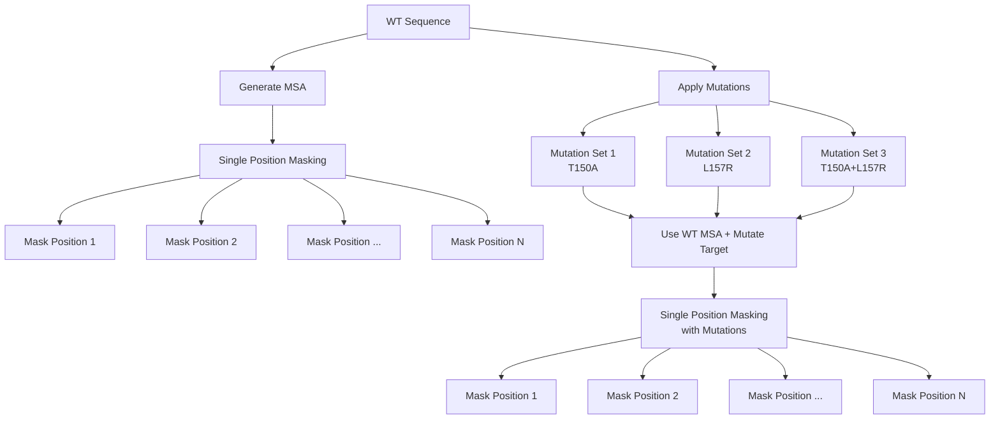
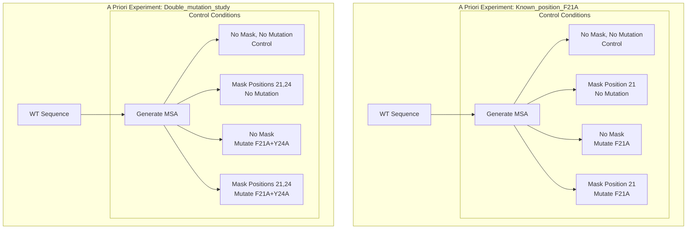
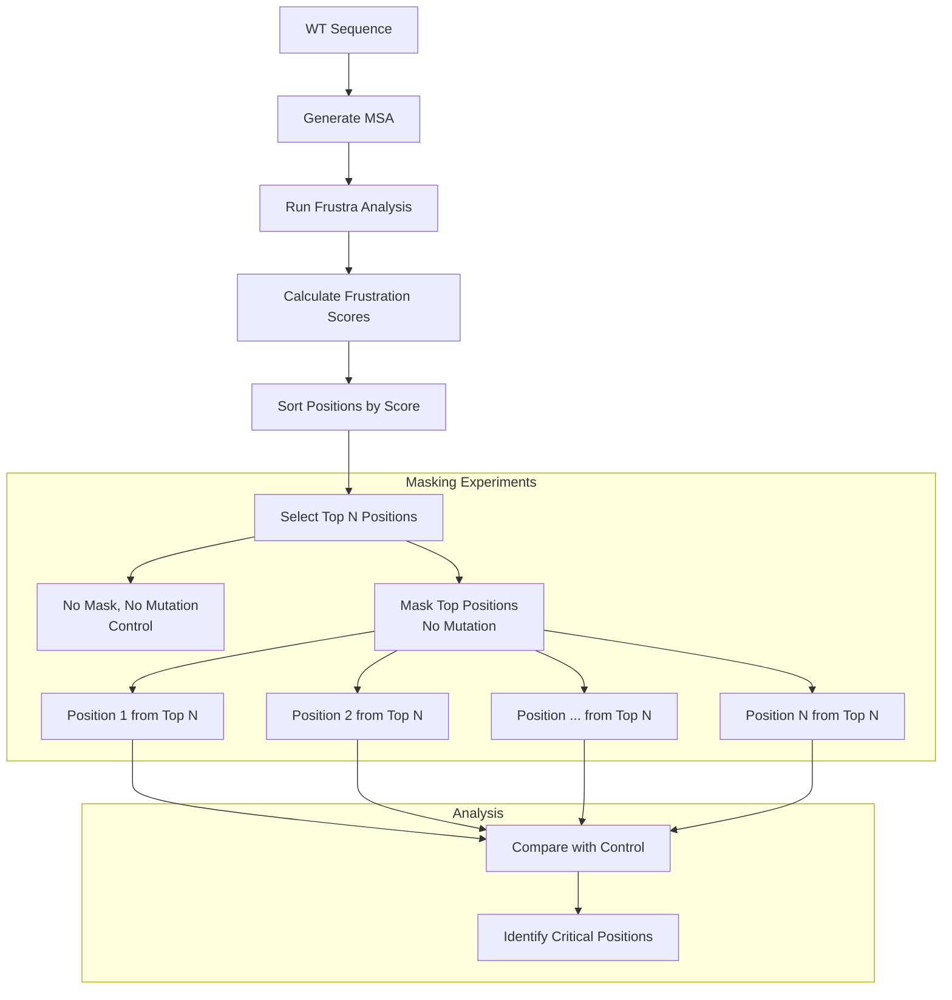

# AlphaMask

AlphaMask is a tool for analyzing protein sequences through various masking strategies.

## Masking Strategies

### 1. Iterative Masking
Systematically explores sequence positions by masking each position independently, with optional mutation analysis.

### 2. A Priori Masking
Focused experiments on known positions of interest with controlled conditions.

### 3. Frustra Masking
Analysis-driven approach using protein frustration patterns to identify positions of interest.

## Installation

# Remove existing experiment folder
rm -rf /work/YOUR_USERNAME_WORKSPACE_FOLDER/my_experiments/ 

# Setup experiment folder
python -m alphamask setup --path /work/YOUR_USERNAME_WORKSPACE_FOLDER/my_experiments 

# Run experiment
python -m alphamask run --container ~/containers/vsc-frustra_masking.sif \
--script /home/sc.uni-leipzig.de/YOUR_USERNAME_WORKSPACE_FOLDER/github/alphamask/predict.py \
--schema /work/YOUR_USERNAME_WORKSPACE_FOLDER/my_experiments/schema/schema_validation.json \
--config /work/YOUR_USERNAME_WORKSPACE_FOLDER/my_experiments/config/test.yaml \
--partition paula --gpu-type a30

# Make sure you select the correct partition and gpu type
# You can find the available partitions and gpu types with the following command:
sinfo -o "%10P %10G %10O %10l %10c"

