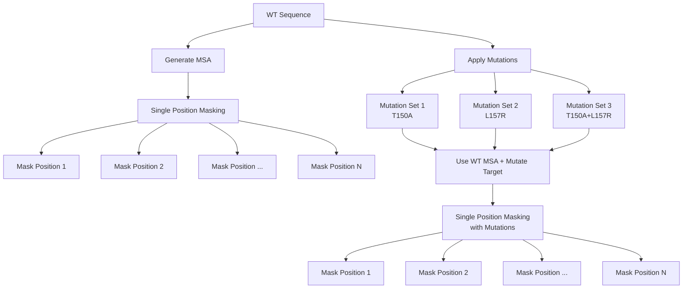
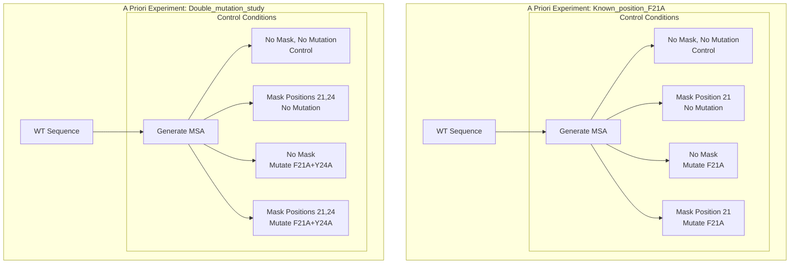
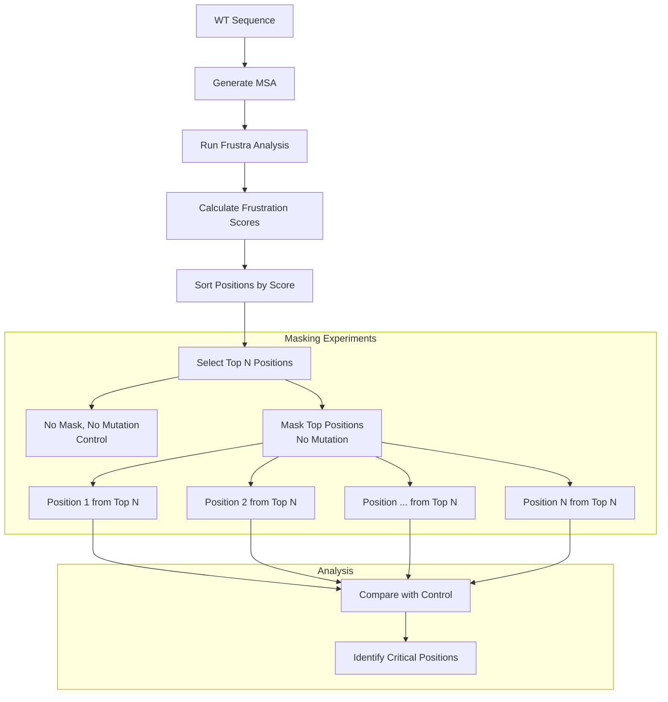

# AlphaMask

AlphaMask is a tool for analyzing protein sequences through various masking strategies.

## Masking Strategies

### 1. Iterative Masking
Systematically explores sequence positions by masking each position independently, with optional mutation analysis.



### 2. A Priori Masking
Focused experiments on known positions of interest with controlled conditions.



### 3. Frustra Masking
Analysis-driven approach using protein frustration patterns to identify positions of interest.



## Installation

### 1. Environment Setup

First, ensure you're on a compute node with GPU access:
```bash
# Request an interactive GPU session (adjust parameters according to your cluster)
srun --job-name "alphamask_setup" \
     --gres=gpu:1 \  # Specify GPU requirements for your cluster
     --time 24:00:00 \
     --partition=YOUR_GPU_PARTITION \  # e.g., gpus, gpu, accelerated, etc.
     --pty bash
```

### 2. Load Required Modules
```bash
# Load CUDA module (version may vary by cluster)
module load cuda  # e.g., cuda/12.6, cuda/11.8, etc.

# Load any additional required modules
module load gcc   # If needed
module load python  # If needed
```

### 3. Create Conda Environment
```bash
# Using micromamba (recommended)
micromamba create -f environment.yml

# Or using conda
conda env create -f environment.yml

# Activate the environment
micromamba activate alphamask  # or conda activate alphamask
```

### 4. Verify Installation
```bash
# Check CUDA availability
python -c "import torch; print('CUDA available:', torch.cuda.is_available())"

# Check GPU visibility
nvidia-smi
```

### 5. Setup Experiment Directory

```bash
# Remove existing experiment folder if needed
rm -rf /path/to/workspace/my_experiments/ 

# Setup experiment folder
python -m alphamask setup --path /path/to/workspace/my_experiments 
```

### 6. Running Experiments

```bash
# Basic experiment run
python -m alphamask run \
    --container /path/to/container/vsc-frustra_masking.sif \
    --script /path/to/alphamask/predict.py \
    --schema /path/to/workspace/my_experiments/schema/schema_validation.json \
    --config /path/to/workspace/my_experiments/config/test.yaml \
    --partition YOUR_GPU_PARTITION \
    --gpu-type YOUR_GPU_TYPE

# Check available partitions and GPU types on your cluster
sinfo -o "%10P %10G %10O %10l %10c"  # For SLURM-based clusters
```

### 7. Extracting Results

```bash
# Extract all PDBs
alphamask extract-pdbs --config config.yaml

# Extract only best predictions
alphamask extract-pdbs --config config.yaml --best-only

# Extract specific models/seeds/recycles
alphamask extract-pdbs --config config.yaml \
    --models model_1 model_2 \
    --seeds 1 2 \
    --recycles 0 1

# Extract for specific proteins
alphamask extract-pdbs --config config.yaml \
    --proteins protein1 protein2 \
    --best-only
```

### Common Cluster-Specific Adjustments

1. **GPU Selection**: Different clusters use different GPU naming conventions:
   - Some use specific models (e.g., `a100`, `v100`, `quadro_rtx_8000`)
   - Others use generic names (e.g., `gpu:1`, `gpu:k80:1`)

2. **Partition Names**: Common variations include:
   - `gpu`, `gpus`, `accelerated`
   - `cuda`, `tesla`, `nvidia`
   - Check your cluster documentation for specific names

3. **Module Names**: Module naming conventions vary:
   - CUDA: `cuda/12.6`, `cuda/11.8`, `nvidia/cuda-12.6`
   - Python: `python/3.10`, `python3`, `anaconda3`

Always consult your cluster's documentation or system administrators for specific configuration details.
